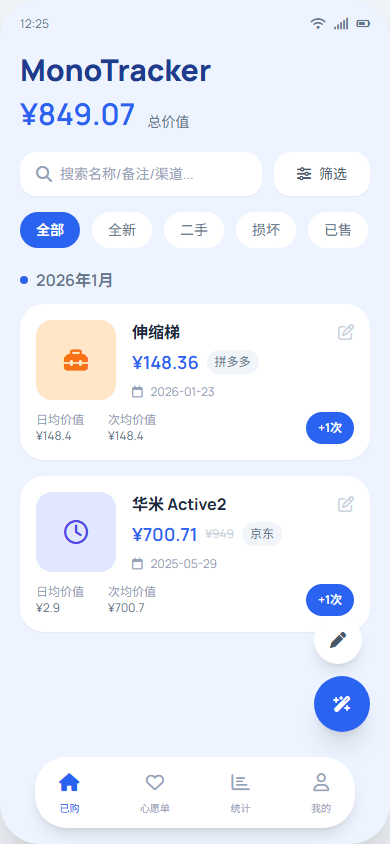
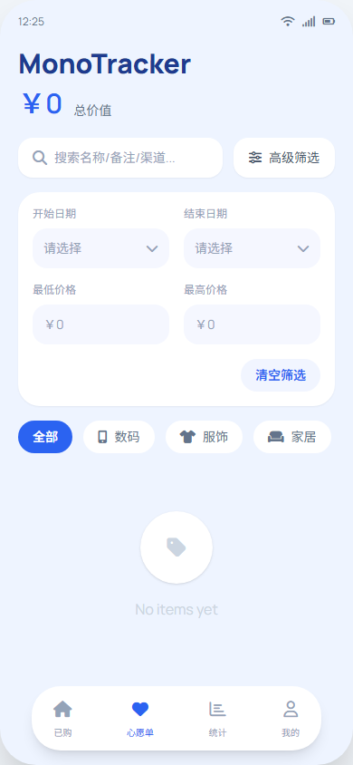
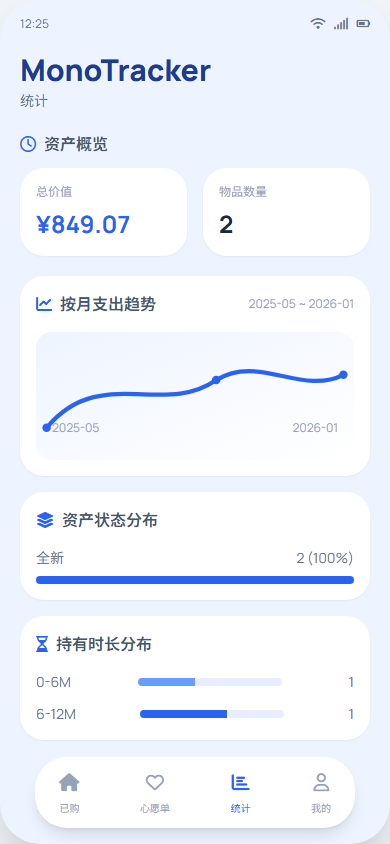
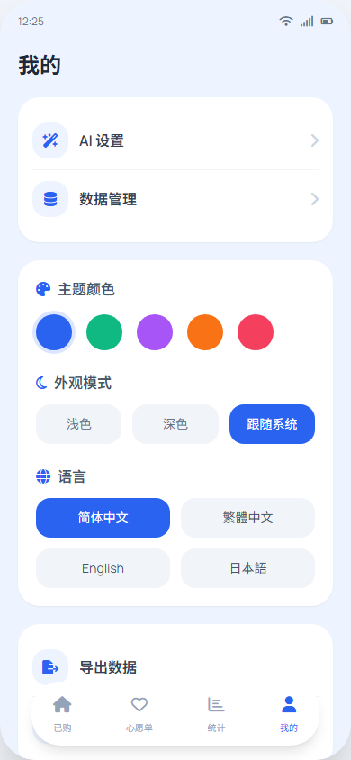
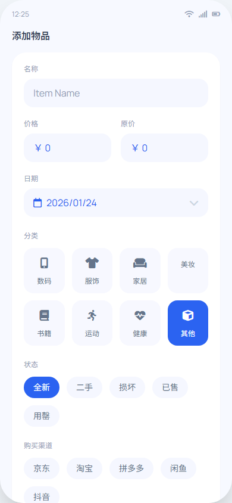
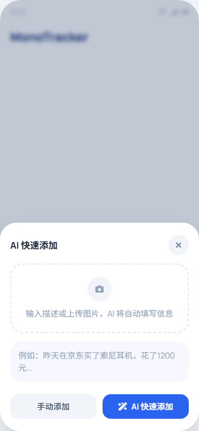
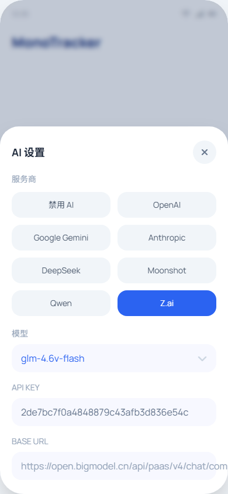
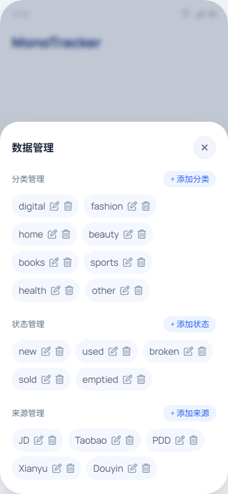

# Tracker

Tracker 是一款本地优先的物品购买与资产追踪应用，支持 AI 快速录入、统计分析、备份与恢复、多维度筛选，适合记录已购与心愿单物品。

## 功能特性
- 已购/心愿单双视图管理，支持新增、编辑、删除
- AI 快速添加：文字 + 图片识别自动填写名称/价格/分类/状态/来源/日期
- 多图联合识别：同一商品可选择多张图片综合分析
- 分类/状态/来源统一管理，支持增删改并同步到已有物品
- 搜索与高级筛选（关键词、日期区间、价格区间）
- 统计面板：月度支出趋势、持有时长分布、渠道分布、分类 Top N、资产概览
- 心愿单历史价格记录与走势统计
- 数据导入/导出（CSV / ZIP）与系统分享
- WebDAV 备份与恢复：每日首次打开自动备份、手动上传、恢复最近 3 次、云端保留 4 次
- WebDAV 备份可选是否包含图片（默认关闭以减少体积）
- 多语言与主题切换、移动端手势返回优化

## 开发技术
- React 19 + TypeScript
- Vite 6
- Tailwind CSS（原子化样式）
- Capacitor 8（Android 打包）
- ECharts 5（统计趋势图）
- JSZip（ZIP 备份导入导出）
- WebDAV（云端备份与恢复）
- LocalStorage 本地存储
- Lucide 图标库
- ESLint + TSC（代码质量与类型检查）
- AI 服务商适配（OpenAI 兼容 / Gemini / Anthropic / 国内厂商）

## 本地运行
1. 安装依赖：`npm install`
2. 启动开发服务：`npm run dev -- --port 3001`

## Android 调试构建
1. 构建前端：`npm run build`
2. 同步原生：`npx cap sync android`
3. 生成 APK：`cd android && .\gradlew assembleDebug`

## App 效果图
> 以下为原型页面导出的 SVG 预览。

## 高保真原型
- 原型总览：`doc/index.html`
- 用户体验分析：`doc/ux-analysis.md`
- 产品界面规划：`doc/ia.md`

